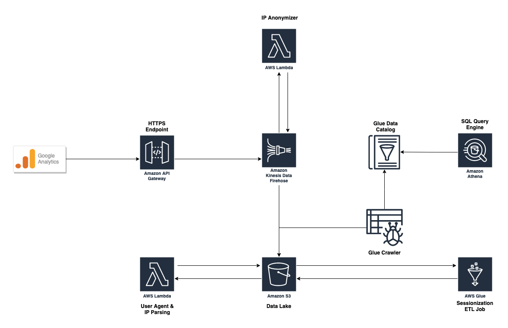
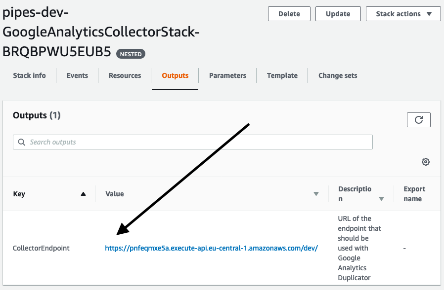

# Google Analytics To S3 
The software automatically duplicates Google Analytics hits to S3.
Additionally, it does ETL (e.g. sessionization, partitioning) on the incoming raw data. Also, the ETL process transforms the raw Google Analytics data to the
BigQuery export schema format. You can query and visualize the data with Amazon
Athena. 

## Architectural Overview



## 4-Step Setup Process (Duration ~ 10 Minutes)

1.  - By clicking the button the stack gets automatically launched in your AWS Account.

2. Create a **Custom JavaScript variable** in Google Tag Manager. **Important:** Don't forget to change the endpoint in the code. The endpoint url will be displayed as the output of the stack [see here](#additional-information)

```js
function() {
  // Add your pipes collector endpoint here
  var endpoint = 'https://collector.endpoint.com/';
  
  return function(model) {
    var vendor = 'com.google.analytics';
    var version = 'v1';
    var path = ((endpoint.substr(-1) !== '/') ? endpoint + '/' : endpoint) + vendor + '/' + version;
    
    var globalSendTaskName = '_' + model.get('trackingId') + '_sendHitTask';
    
    var originalSendHitTask = window[globalSendTaskName] = window[globalSendTaskName] || model.get('sendHitTask');
    
    model.set('sendHitTask', function(sendModel) {
      var payload = sendModel.get('hitPayload');
      originalSendHitTask(sendModel);
      var request = new XMLHttpRequest();
      request.open('POST', path, true);
      request.setRequestHeader('Content-type', 'text/plain; charset=UTF-8');
      request.send(payload);
    });
  };
}
```


3. Edit **EVERY SINGLE** Google Analytics tag whose data you want to send to Pipes. Go to **Tags**, click on a **Tag Name** you want to edit. Click on **Enable overriding settings in this tag**. Click on **+Add Field**, use `customTask` as a field name and `{{Pipes duplicator}}` as a value. Click Save.


4. Publish a new version in Google Tag Manager. After publishing a new version, all Google Analytics hits will be sent to Pipes automatically. Once the data has been collected and transformed, you can query the data e.g. via AWS Athena.


---

### Additional Information
* Google Analytics Duplicator Endpoint



* Inspired by Simo Ahava: [Simo's blog](https://www.simoahava.com)

