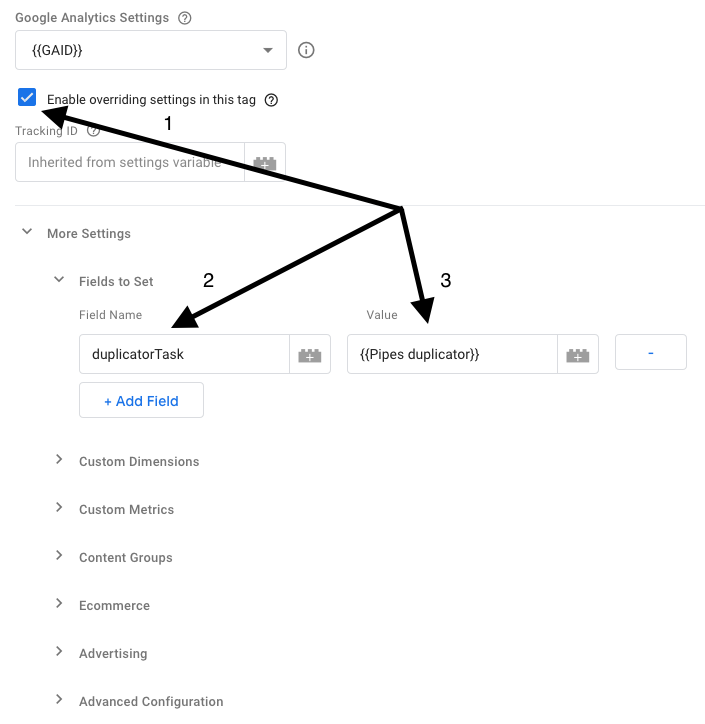

# Google Analytics Duplicator
Yout can automatically duplicate Google Analytics payload to Pipes. You can do it with the help of Google Tag Manager. Below you'll find a step by step instruction.

1. Step: Create a **Custom JavaScript variable** in Google Tag Manager. Call the variable `Pipes duplicator` and add the following code:

```js
function() {
  // Add your snowplow collector endpoint here
  var endpoint = 'https://collector.simoahava.com/';
  
  return function(model) {
    var vendor = 'com.google.analytics';
    var version = 'v1';
    var path = ((endpoint.substr(-1) !== '/') ? endpoint + '/' : endpoint) + vendor + '/' + version;
    
    var globalSendTaskName = '_' + model.get('trackingId') + '_sendHitTask';
    
    var originalSendHitTask = window[globalSendTaskName] = window[globalSendTaskName] || model.get('sendHitTask');
    
    model.set('sendHitTask', function(sendModel) {
      var payload = sendModel.get('hitPayload');
      originalSendHitTask(sendModel);
      var request = new XMLHttpRequest();
      request.open('POST', path, true);
      request.setRequestHeader('Content-type', 'text/plain; charset=UTF-8');
      request.send(payload);
    });
  };
}
```

2. Step: Edit every single Google Analytics tag whose data you want to send to Pipes. Go to **Tags**, click on a **Tag Name** you want to edit. Click on **Enable overriding settings in this tag**. Click on **+Add Field**, use `duplicatorTask` as a field name and `{{Pipes duplicator}}` as a value. Click save.



3. Step: Publish a new version.


[Source ~ Simo Ahava](https://www.simoahava.com)
